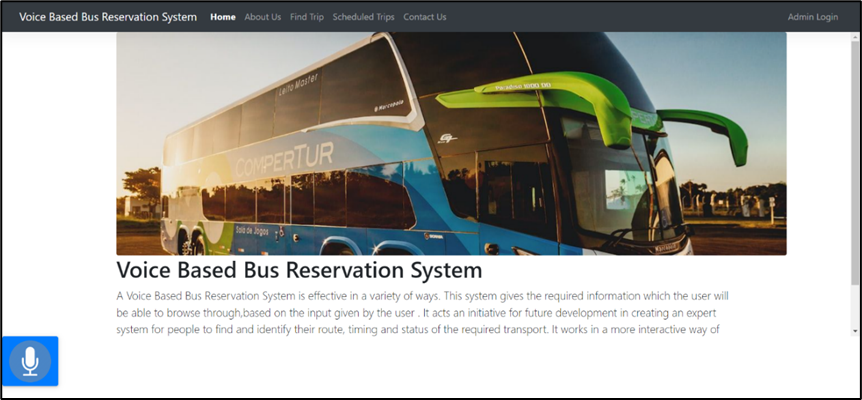

# Voice-Based Bus Reservation System

The Voice-Based Bus Reservation System is a user-friendly solution that allows users to effortlessly reserve bus tickets using voice commands. By incorporating cutting-edge speech-to-text (STT) and text-to-speech (TTS) technologies, this system streamlines the reservation process while enhancing accessibility for all users.

 <!-- Replace with a link to a GIF/video showcasing the system in action -->

## Table of Contents

- [Features](#features)
- [Installation](#installation)
- [Usage](#usage)
- [Technologies](#technologies)
- [APIs](#apis)
- [Screenshots](#screenshots)
- [Contributing](#contributing)
- [License](#license)

## Features

- **Voice Commands**: Utilize voice commands for reserving bus tickets, creating a seamless user experience.
- **Seat Availability**: Instantly check the availability of seats on various buses.
- **Seat Reservation**: Effortlessly reserve seats using voice commands.
- **Reservation Status**: Inquire about the current status of your reservations.
- **User-Friendly Interface**: Intuitive interface for easy navigation and interaction.
- **Feedback and Confirmation**: Receive real-time feedback and confirmation on your reservations.

## Demo

Check out our [demo video](demo.mp4) <!-- Replace with a link to a demo video -->

## Installation

1. Clone the repository: `git clone https://github.com/RAHUL-R10/Voice-Based-Transport_enquiry-System.git`
2. Navigate to the project directory: `cd voice-bus-reservation`
3. Install dependencies: `pip install -r requirements.txt`

## Usage

1. Start the Django development server: `python manage.py runserver`
2. Open the application in your web browser: `http://localhost:8000`

## Technologies

- **Frontend**: HTML, CSS, JavaScript
- **Backend**: Python
- **Database**: SQLite
- **Framework**: Django

## APIs

- **Text-to-Speech API**: Integrated responsive API for text-to-speech functionality.
- **Speech-to-Text API**: Incorporated responsive API for speech-to-text functionality.
- [responsive api](https://responsivevoice.org/api/)

## Screenshots

 <!-- Replace with actual screenshot -->
 <!-- Replace with actual screenshot -->
 <!-- Replace with actual screenshot -->
 <!-- Replace with actual screenshot -->
 <!-- Replace with actual screenshot -->
 <!-- Replace with actual screenshot -->
 <!-- Replace with actual screenshot -->
 <!-- Replace with actual screenshot -->
 <!-- Replace with actual screenshot -->
 <!-- Replace with actual screenshot -->
 <!-- Replace with actual screenshot -->
 <!-- Replace with actual screenshot -->
 <!-- Replace with actual screenshot -->

<!-- Add more screenshots as needed -->

## License

This project is licensed under the [MIT License](LICENSE).

